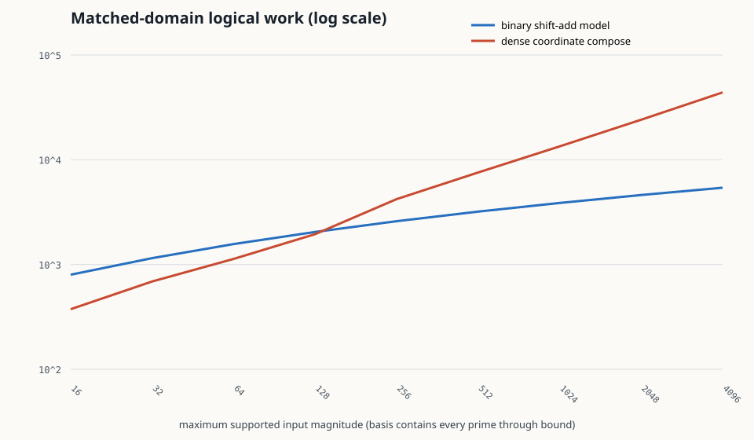

# Prime Axiom Software — Build 000 report

Status: **COMPLETE WITH BOUNDED EVIDENCE**
Date: 2026-08-24
Repository: `Grativy6/Prime_Axiom_Software`

## Result

The computational floor did not become prime-native.

Build 000 reached abstract two-state distinction, transition, ideal switching, NAND-derived Boolean logic, feedback memory, registers, unary quantity, binary counters, fixed-width binary arithmetic, dense and sparse prime-exponent representations, and a receipt-bearing experimental VM. The first coherent fork occurred **after stable identity and memory but before choosing a numeric representation and arithmetic unit**.

The motivating intuition survives only in a local form:

> When exact factor structure is already resident and the workload remains multiplicative, exponent coordinates can exchange more state and configuration for dramatically less local logical work and shallow parallel depth.

It does not survive as a general replacement foundation:

> To represent arbitrary integers, a dense prime bank grows a lane for every supported prime; sparse forms pay identity and routing; magnitude ingestion pays factorization; addition and numeric order cross domains; zero, sign, overflow, and basis escape need explicit state. Binary remains a natural substrate and magnitude/control representation.

The genuinely interesting direction is therefore a typed **multiplicative structural coprocessor or sidecar**, not a prime-only CPU: retain verified factor/valuation structure when it is born cheaply, keep an exact magnitude or cofactor path, and meter every crossing.

## What was built

```text
abstract readable state
    -> transition / ideal relay contact
    -> NAND as one logical gate basis
    -> derived gates
    -> SR and gated-D latch model
    -> register / counter
    -> representation fork
         |-> unary marks -> quantity by occupancy
         |-> binary word -> add / subtract / compare / multiply
         `-> configured generator lanes
                -> dense prime exponents
                -> sparse prime exponents
                -> compose / cancel / gcd / lcm / divides / project
                -> explicit factor / reconstruct / add-refactor crossings
                -> minimal receipt-bearing VM
```

The two arithmetic lineages share `BitState`, NAND accounting, binary exponent counters, and state machinery. Prime coordinates were not granted a hidden arithmetic oracle. `BigInteger` is confined to semantic inputs, differential-test oracles, reconstruction, reporting, and host controls.

Key implementation areas:

- `src/PrimeAxiom.Core/Substrate`: state, transition, relay contacts, NAND network and cost.
- `src/PrimeAxiom.Core/Circuits`: fixed binary words, gate-derived arithmetic, latches, registers, counters.
- `src/PrimeAxiom.Core/Representations`: unary, dense/sparse prime coordinates, explicit zero/sign tags.
- `src/PrimeAxiom.Core/Machine`: the bounded prime-coordinate interpreter.
- `src/PrimeAxiom.Cli`: demo, correctness receipt, cost sweeps, benchmarks, and SVG generation.
- `tests/PrimeAxiom.Tests`: exhaustive and seeded differential tests.

## Evidence summary

### Correctness

- 35/35 xUnit tests passed; the sanitized receipt is `results/build000/test-summary.json` and the identity-bearing raw TRX is ignored.
- The independent experiment runner passed 26,764 checks with zero failures.
- Exact bounded domains are recorded in `results/build000/correctness.json`; the largest pairwise prime domain is `1..64 x 1..64`, with 5,000 additional seeded composition trials.
- The result is `BOUNDED_PASS`, not a proof over unbounded integers or a hardware verification claim.

### Dense matched-domain sweep

When each machine had to represent every positive input through the same bound, dense coordinate composition used fewer logical NAND evaluations only through the tested bound 128. It then lost rapidly as required prime lanes accumulated:

| Maximum input | Binary input bits | Binary multiplier NANDs | Required prime lanes | Dense prime payload bits | Prime-compose NANDs |
|---:|---:|---:|---:|---:|---:|
| 16 | 5 | 800 | 6 | 24 | 375 |
| 128 | 8 | 2,048 | 31 | 124 | 1,950 |
| 256 | 9 | 2,592 | 54 | 270 | 4,209 |
| 1,024 | 11 | 3,872 | 172 | 860 | 13,413 |
| 4,096 | 13 | 5,408 | 564 | 2,820 | 43,989 |

This comparison favors neither implementation universally. The binary multiplier is a transparent shift-and-add model rather than an optimized multiplier. The prime machine assumes lane-parallel logic and does not include physical routing. The crossover is a property of these declared models.



### Factor-resident sweep

For 64 seeded pairs born as exponents over the first eight primes, coordinate composition won modeled NAND count in all 64 cases:

- median binary multiplication: 59,168 NAND evaluations;
- coordinate composition, including balanced overflow-status reduction: 981 NAND evaluations;
- median two-operand binary payload: 86 bits;
- two-operand dense coordinate payload: 128 bits.

That is a real local trade in the model: more stored state and fixed catalogue structure bought much less resident multiplication work. It does not include factorization because the workload was explicitly born factorized.

### Addition and support

Across 256 seeded additions in `1..256`, product support always equaled the union of input prime supports. Only 4 sums preserved that same support; addition changed a mean of 4.488 support lanes and a maximum of 7. Refactoring tested a mean of 99.859 prime remainders with the intentionally simple trial-division encoder.

The result supports a distinction between representation-local and representation-transforming operations. It does not establish a general hardness theorem for factorized addition.

### Representation cost

With a 25-prime dense basis and 8-bit exponents, every value occupied 200 payload bits. Binary `12` used 4 bits; its estimated sparse coordinate payload used 31 bits. Binary `30,030` used 15 bits; its sparse payload used 83 bits. The dense form correctly rejected primes outside its configured basis rather than pretending they were represented.

Sparse coordinates reduce empty-lane waste but pay lane IDs, merge comparisons, exponent fields, variable length, and real-world allocation/locality. The recorded sparse counts are payload estimates, not total managed memory.

### Managed runtime

The microbenchmarks confirm that implementation overhead and abstraction level dominate naive wall-clock comparisons. Optimized host `BigInteger` controls were substantially faster than the transparent managed gate models on this run. Dense coordinate composition and gate-modeled binary multiplication were close only for the specific unmatched microbenchmark shapes. These timings are useful for profiling this code, not for a hardware-performance claim.

## Answers to the thirteen completion questions

### 1. What computational primitives did we actually reach?

The lowest executable primitive is a readable abstract two-state value, not a host integer. The repository models explicit state transitions and an ideal relay contact, derives logic from NAND, iterates a cross-coupled NAND latch with an exposed forbidden condition, builds gated D storage, registers, and binary counters, and constructs add/subtract/compare/multiply circuits from the same gate network.

The build does not reach transistors, electromagnetic relay dynamics, contact bounce, analog metastability, device energy, lithography, or measured physical hardware. “NAND” is the practical logical floor of the experiment, not a claim about the floor of nature.

### 2. Which conventional assumptions were unavoidable?

Within any finite exact digital machine that must distinguish later behavior:

- distinguishable states or trajectories;
- stable enough identity to route and recover state;
- finite storage and an overflow/extension rule;
- ordering or addressing of ports, lanes, or records;
- transition/control semantics;
- an interpretation that maps physical or abstract states to a represented domain;
- explicit handling of invalid, unknown, or out-of-range state.

Prime coordinates did not remove counting. Their exponents are quantities; compact exponents use binary adders and carry. Prime identity did not remove addressing. It lived in lane position or sparse keys.

### 3. Which assumptions were merely conventional?

The following were not forced by the lower substrate:

- binary state meaning binary magnitude;
- one positional radix for every data type;
- a centralized, general-purpose `ADD/SUB/MUL/DIV/SHIFT/COMPARE` ALU;
- storing every integer only as canonical magnitude;
- stored-program control as the first form of programmability;
- separating registers and arithmetic exactly as a modern CPU does;
- evaluating or normalizing every expression immediately.

Unary occupancy, decimal mechanisms, residue coordinates, logarithmic systems, factor bases, sparse monomials, cards, plugboards, and specialized recurrence engines are historical or technical counterexamples to those assumptions.

### 4. At what layer does prime-native representation first make coherent sense?

After the machine can preserve and address distinct generator identities and multiplicity counters. In this build that is the representation layer above registers.

Below that point the atoms can only be opaque distinguishable states. Calling them number-theoretic primes requires an externally established multiplication/divisibility structure and a verified map to ordinary primes. A generator bank can exist before magnitude; **prime semantics cannot exist before identity and arithmetic structure**.

### 5. Can it exist naturally on ordinary binary machinery?

Yes. This is one of the clearest results. A prime lane is a binary register holding an exponent; composition is a bank of binary adders; tests, status, sparse keys, catalogue addresses, and VM control can all be binary. Nothing in the local advantage requires replacing bits.

The plausible form is:

```text
binary state and control
    -> factor/valuation registers beside magnitude registers
    -> specialized multiplicative operations
    -> explicit conversion and validity state
```

### 6. Which operations become simpler?

For already canonical, covered coordinates:

- multiplication becomes exponent addition (`COMPOSE`);
- exact division becomes checked exponent subtraction (`CANCEL`);
- divisibility becomes coordinatewise comparison;
- gcd/lcm become coordinatewise min/max;
- valuation is a lane read;
- powers scale exponents, although Build 000 did not add a separate power circuit;
- rational cancellation would become local with signed exponents, although the implemented core remains integer-focused.

The simplification is representational locality, not absence of work.

### 7. Which operations become harder?

- importing an arbitrary magnitude, because its factorization must be discovered or supplied and verified;
- arbitrary addition/subtraction, because output factor structure is not a local function of input coordinates;
- increment-heavy loops, because consecutive integers are coprime;
- numeric order, because exponent componentwise order is divisibility, not magnitude order;
- arbitrary output in ordinary notation;
- zero and signed addition;
- representing primes outside a finite basis;
- memory management and routing in sparse dynamic forms.

### 8. Where are costs merely displaced?

- prime identity moves into a catalogue, sparse key, intern table, or physical lane;
- multiplication moves into exponent adders and routing;
- constant-looking token concatenation moves work into normalization and storage;
- sparse compression moves work into metadata, merge, allocation, and locality;
- compact huge exponents move work into reconstruction/output length;
- lazy addition moves work into expression growth, equality, comparison, or eventual normalization;
- a factor cache moves work into construction, validation, invalidation, and eviction;
- a fixed basis moves unrepresented structure into an explicit cofactor or failure.

### 9. Did an unexpected representation or architecture emerge?

The strongest architecture was not pure prime coordinates. It was a **typed multi-domain value**:

```text
zero/sign
+ exact ordinary magnitude or exact cofactor
+ optional verified prime factors / bounded valuations
+ optional residues or log interval
+ independent validity/provenance bits
```

Multiplicative operations update factor state cheaply when valid. Addition updates magnitude and invalidates or partially preserves factor state. `ADD_SPLIT` can retain a known common factor and leave a typed residual rather than pretending the whole sum stayed local. This resembles a structural sidecar, arithmetic IR, or coprocessor.

The experimental VM also changed shape. Its honest primitives are `COMPOSE`, `CANCEL`, `MEET`, `JOIN`, and `PROJECT`; `LOAD_MAGNITUDE`, `RECONSTRUCT`, and `ADD_REFACTOR` are explicitly expensive boundary instructions. A generic `DECOMPOSE` instruction was rejected because it would hide arbitrary factorization behind a friendly verb.

### 10. What prior art most closely resembles the work?

The mathematical representation is already exact and well known:

- finitely supported prime-exponent/valuation maps and the free commutative monoid;
- mathlib's executable `Nat.factorization` model;
- monomial exponent vectors and sparse computer algebra;
- fixed factor bases and smooth-number exponent vectors;
- products of exponentials and succinct arithmetic circuits.

The operation asymmetry has close machine precedents in logarithmic and multidimensional logarithmic number systems. Residue number systems are the most important control: they make both addition and multiplication local over a bounded range and show that “number-theoretic coordinates must disrupt addition” is false in general. Double-base systems and lazy straight-line programs resemble a sum/product expression extension. Fermi-Dirac prime-power bits expose exponent counters as bit planes.

Build 000 found no strong source in its bounded search for a general-purpose processor that canonically stores every arbitrary integer as its complete factorization. That is a search result, not proof of absence or novelty. The ranked analysis and sources are in `docs/HISTORY_AND_PRIOR_ART.md`.

### 11. What experiments failed?

Several motivating framings failed before or during implementation:

- Prime identity could not be placed below stable distinction and identity without becoming an ungrounded label.
- Dense prime lanes did not scale as a universal representation; the matched-domain sweep reversed their local gate-count advantage after the tested 128 bound and their payload was already much larger.
- The empty vector could not represent both zero and one; an explicit tag was required.
- Prime indices were not free; they imported order and a catalogue.
- “Multiplication becomes merge” was incomplete; matching exponents still required ordinary addition and sparse identities required comparisons.
- Addition was not “wrong” and did not uniquely lose information. It was simply nonlocal to canonical factor coordinates.
- A pure factor VM could not honestly support general input, output, addition, addressing, and comparison without boundary operations.
- Managed wall-clock timing could not stand in for hardware cost; optimized host arithmetic overwhelmed transparent simulations.

These are successful negative results because they narrow the design space.

### 12. What remains genuinely interesting after removing known or trivial content?

Not the prime-vector representation itself. That is established.

What remains interesting is the systems question:

> Can a value carry verified multiplicative structure as a first-class, independently valid computational asset—alongside magnitude and selected residues—so real workloads amortize its construction and avoid unnecessary destruction/recovery?

The experiment found a measurable local area/work trade: resident smooth values used more payload but far fewer logical gate evaluations for composition. The open novelty boundary is engineering: provenance-aware factor certificates, partial valuation banks, exact cofactors, validity transitions, additive common-factor splitting, and workload/synthesis evidence.

### 13. What should Build 001 attack?

Build 001 should implement and try to break a **bounded valuation bank plus exact cofactor**, not expand the pure dense machine.

Proposed value contract:

```text
HybridInteger<B> =
  zero/sign
  + exact binary cofactor
  + exponent lanes for selected p in B
  + invariant gcd(cofactor, product(B)) = 1
  + optional full-factor certificate
  + validity/provenance/version bits
```

It should then:

1. compare magnitude-only, sparse full factor, dense basis, and hybrid forms on values born from factorial/binomial products, rational cancellation chains, smooth-number filtering, divisibility queries, and mixed add/multiply kernels;
2. implement `INGRESS_BASIS`, `COMPOSE`, `CANCEL`, `GCD_PARTIAL`, `ADD_SPLIT`, `RECONSTRUCT`, and explicit invalidation/refresh;
3. preserve a composite cofactor as `OPAQUE_COFACTOR`, never as a fake prime atom;
4. add selected residues or p-adic unit digits as an ablation for additive queries;
5. cap and benchmark a lazy sum/product DAG against eager reconstruct/refactor;
6. synthesize a small exponent bank, a fair parallel binary multiplier, and a Fermi-Dirac exponent-bit variant in one HDL/tool/library, reporting area, delay, routing, toggles, and throughput separately;
7. preregister workload distributions, cache budgets, forcing points, and failure criteria;
8. stop if the hybrid cannot amortize factor-certificate construction on a named workload.

The Build 001 success criterion is not “beat binary.” It is to find at least one reproducible workload and resource profile where preserved multiplicative structure lies on a Pareto frontier after ingress, storage, invalidation, and egress are charged—or to close that direction as a dead end.

## Historical answer in one sentence

Computing did not move inevitably from bits to binary integers: it repeatedly chose representations and control forms around workload, medium, reliability, and human interface. The durable choice was not binary magnitude alone but **reliable distinguishable state plus configurable interpretation**. Prime structure can exploit that freedom above memory, not underneath it.

## Reference-lens crosswalk

The PAL v2.2 and A0/Software documents were not used as specifications. After the experiments, three analogies were noted: the implementation makes state distinctions explicit; receipts keep conversion and failure trace; and each result has a local claim ceiling. Those analogies did not select the architecture or validate the arithmetic. The source hashes and non-adoption boundary are in `docs/REFERENCE_BOUNDARY.md`.

## Reproduction and receipts

```powershell
& .\scripts\verify.ps1
dotnet run --project src/PrimeAxiom.Cli --configuration Release --no-build -- demo
```

Evidence map:

- method and limits: `docs/RESEARCH_METHOD.md`
- representation contracts: `docs/REPRESENTATION_CONTRACTS.md`
- classified findings: `docs/OBSERVATIONS.md`
- history and prior art: `docs/HISTORY_AND_PRIOR_ART.md`
- supplied-reference boundary: `docs/REFERENCE_BOUNDARY.md`
- raw deterministic and host receipts: `results/build000/`
- durable future-run guidance: `AGENTS.md`

Build 000 stops here because it has earned a clear next experiment. It does not stop because prime-native computation was proven or disproven in general.
