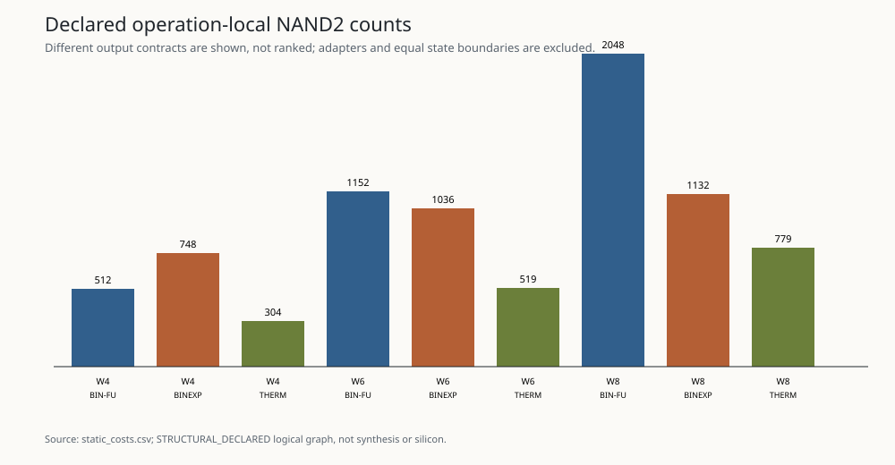

# Prime Axiom Software

Prime Axiom Software asks what mathematics becomes inexpensive when two machines are built from the same binary state, NAND logic, and DFF-delimited memory but diverge at numeric representation.

Build 003 now exposes the narrow structure that survived those lower-level experiments as a usable software tool:

```text
integer in -> certified prime powers + exact residual + receipt out
```

Its framework status is **`BOUNDED_TOOL_PATH_VALIDATED`**: 52,914 deterministic checks passed with zero failures across complete, partial, signed, zero/unit, seeded, parser-boundary, and six frozen arithmetic-path cases. Calculator-issued receipts are immutable, distinguish complete structure from an exact unresolved residual, and expose construction, integrity-replay, and egress work separately. Complete multiplication receipts compose by exponent-map merge after explicit acquisition; general addition still performs ordinary magnitude addition and fresh output factor discovery. No LLM-cognition, runtime, or hardware advantage is claimed.

```powershell
dotnet run --project src/PrimeAxiom.Cli --configuration Release -- prime-receipt 360
dotnet run --project src/PrimeAxiom.Cli --configuration Release -- compare-arithmetic multiply 218 489 175 17
```

The user examples produce:

```text
125891290390 + 12589127501265
= 12715018791655
= 5 * 23 * 31 * 103 * 34627429

218 * 489 * 175 * 17
= 317140950
= 2 * 3 * 5^2 * 7 * 17 * 109 * 163
```

The comparison uses replayable public arithmetic traces, not a claimed view of an LLM's private chain of thought. See the [Build 003 report](BUILD_003_REPORT.md) and [calculator contract](docs/PRIME_RECEIPT_CALCULATOR.md).

Build 002’s frozen terminal classification is **`NO_HARDWARE_ADVANTAGE`**. This is a strict Pareto result for the bounded W4/W6/W8 experiment matrix—not a claim that valuation hardware has no local use.

The machine found two different kinds of natural mathematics:

- binary positional state remains the compact general-purpose choice for magnitude, addition, comparison, and arbitrary support;
- resident bounded prime valuations naturally realize componentwise composition/cancellation, divisibility order, meet/join, and monotone threshold predicates.

The second structure is real. At W8, the integrated warm valuation SCALE/CANCEL machine uses 864 NANDs at depth 38 versus 3,959 NANDs at depth 448 for the matched binary machine. But it needs 15 state bits versus 8, and the W8 cold encoder and reconstruction adapters cost 4,786 and 18,343 NANDs. Reconstructing once at trace end still wins on the measured cycle/NAND dimensions; reconstructing after every operation loses on them. Adapter transition totals remain `NOT_MEASURED`, so neither comparison is silently promoted to full-vector dominance. The integrated exact sidecar also loses its matched static comparison: 15,871 NANDs and 26 DFFs versus 4,242 NANDs and 8 DFFs for binary magnitude.

So the answer is not “prime structure is unnatural.” It is: **bounded valuation geometry is a natural warm structural specialization above binary, while ordinary magnitude remains the natural boundary for general computation on this floor.** Addition exposes the boundary by preserving common valuation lower bounds but often invalidating exact metadata.

The generated terminal receipt contains 656,810 arithmetic checks with zero failures, while the completed repository verifier ran 211/211 tests with zero skipped. The pinned HDL flow passed 260/260 cases, including 15 formal proofs and 150 synthesis rows with all warning counts measured. These are logical NAND/DFF and bounded verification results, not placed-and-routed silicon claims.



## Evidence map

- [Build 003 final report](BUILD_003_REPORT.md)
- [Frozen Build 003 protocol](research/build003_experiment_plan.md)
- [Prime Receipt Calculator contract](docs/PRIME_RECEIPT_CALCULATOR.md)
- [Generated Build 003 evidence](results/build003/README.md)
- [Build 003 manifest](results/build003/manifest.json)
- [Build 002 final report](BUILD_002_REPORT.md)
- [Frozen Build 002 protocol](research/build002_experiment_plan.md)
- [Generated terminal coverage](results/build002/protocol_coverage.json)
- [Generated evidence manifest](results/build002/manifest.json)
- [Hardware experiments](docs/HARDWARE_EXPERIMENTS.md)
- [Hardware architecture](docs/HARDWARE_ARCHITECTURE.md)
- [Hardware mathematics](docs/HARDWARE_MATHEMATICS.md)
- [Hardware cost model](docs/HARDWARE_COST_MODEL.md)
- [Hardware prior art](docs/HARDWARE_PRIOR_ART.md)
- [Classified observations](docs/OBSERVATIONS.md)
- [Build 001 report](BUILD_001_REPORT.md) — preserved pilot status: `PARTIAL — PILOT_NEGATIVE; FINAL DECISION NOT EARNED`
- [Build 000 report](BUILD_000_REPORT.md)

## Reproduce

The Build 003 verifier is software-only. It protects every inherited report/result directory, runs the complete zero-skip test assembly, requires the exact registered check/row/family/conclusion set, generates the new evidence twice, compares bytes, and validates the committed manifest. Verifier-owned output is restricted to `artifacts/` or `.artifacts/`; one generator invocation cannot certify deterministic replay:

```powershell
& .\scripts\verify-build003.ps1
```

Build 003 deliberately defers Build 002's proposed physical valuation-service experiment. To reproduce the existing Build 002 hardware result, use the separate pinned HDL path below.

The repository pins .NET 8 and OSS CAD Suite 2026-08-24. The complete verifier preserves Build 000/001, runs formatting/build/tests with zero skips, executes the HDL simulation/formal/synthesis matrix, generates Build 002 twice, and verifies deterministic manifest hashes:

```powershell
& .\scripts\verify-build002.ps1
```

Run that path on Linux x64 to reproduce the protocol-selected canonical terminal HDL receipt and committed platform-dependent bytes. A standalone Windows run is `PASS` only as `WINDOWS_REPRODUCIBILITY_NONTERMINAL` and intentionally remains `PARTIAL — FINAL DECISION NOT EARNED`. The paired verifier compares ordered HDL semantics, stable synthesis fields, and platform-neutral generated files; platform, tool, and netlist hashes may differ.

The HDL toolchain download is large. For a quick source-level check:

```powershell
dotnet restore PrimeAxiom.sln --locked-mode
dotnet test PrimeAxiom.sln --configuration Release
```

Raw HDL logs and netlists stay under ignored `.artifacts/` directories; validated, path-sanitized summaries are committed under `results/build002/`.
