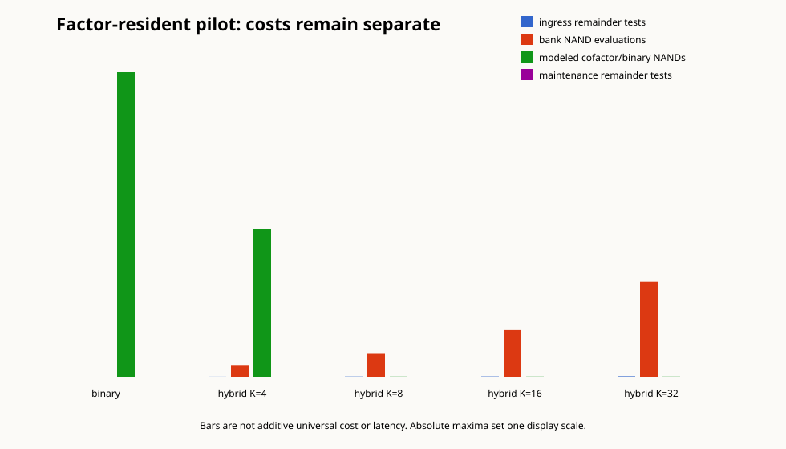

# Prime Axiom Software

Prime Axiom Software is an adversarial research build asking where verified multiplicative structure is worth preserving above an ordinary binary floor.

Build 000 earned the fork point: prime structure does not replace distinction, state, switching, memory, or binary arithmetic. Build 001 implemented the recommended finite valuation bank plus exact cofactor and then attacked it with addition, bank migration, malformed states, differential tests, cost receipts, and favorable and hostile workloads.

Build 001's status is **`PARTIAL — PILOT_NEGATIVE; FINAL DECISION NOT EARNED`**. The representation is exact and the factor-resident multiplication mechanism is real, but tested banks used much more logical payload than binary, the timed hybrid multiplication probes lost badly to the host `BigInteger` multiplication control, addition generated extensive deferred-valuation debt, and adaptive membership incurred global migration costs. Evidence coverage is explicitly `PILOT_SUBSET_COMPLETE_FULL_CONFIRMATION_NOT_RUN`; the frozen stop rule was not met, and no terminal, general-impossibility, or hardware claim follows.

The pilot suggests a narrower next direction if partial closure is accepted: exact ordinary magnitude plus a sparse, demand-driven cache of certified valuations, compared against optimized magnitude and mature factored-arithmetic systems.



## Evidence map

- [Build 001 report](BUILD_001_REPORT.md)
- [Build 001 frozen experiment protocol](docs/EXPERIMENTS_BUILD001.md)
- [Build 001 prior-art reconciliation](docs/PRIOR_ART_BUILD001.md)
- [Build 001 cost model](docs/COST_MODEL.md)
- [Checked Build 001 pilot receipts](results/build001/manifest.json)
- [Build 000 report](BUILD_000_REPORT.md)
- [Architecture](docs/ARCHITECTURE.md)
- [Representation contracts](docs/REPRESENTATION_CONTRACTS.md)
- [Build 000 experiment register](docs/EXPERIMENTS.md)
- [Classified observations](docs/OBSERVATIONS.md)
- [History and prior art](docs/HISTORY_AND_PRIOR_ART.md)
- [Research method and limits](docs/RESEARCH_METHOD.md)
- [Supplied-reference boundary](docs/REFERENCE_BOUNDARY.md)
- [Raw Build 000 receipts](results/build000/manifest.json)

## Quick start

Requires the .NET 8 SDK pinned by `global.json`.

```powershell
& .\scripts\verify-build001.ps1
dotnet run --project src/PrimeAxiom.Cli --configuration Release --no-build -- demo
```

Build 000 alone remains reproducible with `& .\scripts\verify.ps1`. Checked-in functional receipts and variable timing receipts record their environment and hashes under `results/build000/` and `results/build001/`; wall-clock benchmark values are expected to vary on another host.
