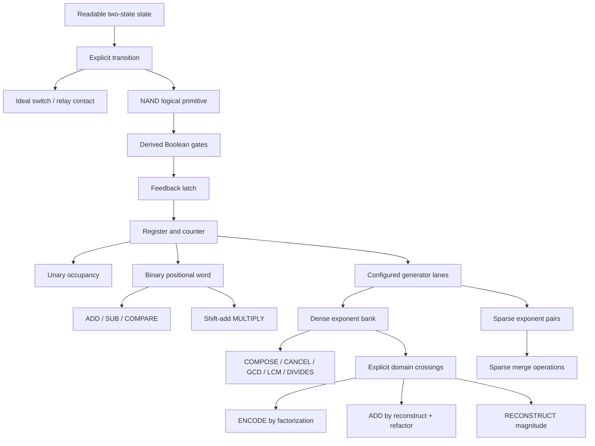
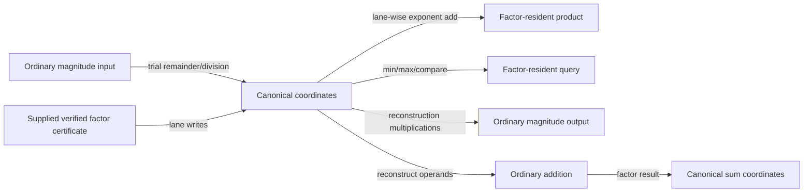

# Build 000 architecture

## Earned fork



The fork is at representation, not at the physical or logical state floor. Both numeric paths use ordinary binary cells; the coordinate path also uses binary arithmetic inside exponent lanes.

## Cost flow



The shortest arrow in source code is not assumed to be the cheapest. Receipts retain gate work, trial operations, reconstruction multiplications, and lane traffic separately.

## Type boundary

```text
PrimeBasis
  - finite ordered ordinary-prime labels
  - configured/certified outside the datapath

PrimeCoordinates
  - positive values only
  - one fixed-width binary exponent per basis lane
  - 1 = all-zero exponents
  - basis escape and exponent overflow are explicit failures

TaggedPrimeValue
  - zero tag OR sign + positive PrimeCoordinates

SparsePrimeCoordinates
  - sorted unique nonzero (lane index, exponent) pairs
  - abstract merge and payload accounting
```

## VM boundary

The VM is a probe, not a proposed general CPU.

| Local instruction | Boundary instruction |
|---|---|
| `LOAD_CERTIFIED` | `LOAD_MAGNITUDE` |
| `COMPOSE` | `RECONSTRUCT` |
| `CANCEL` | `ADD_REFACTOR` |
| `MEET` / `JOIN` |  |
| `PROJECT` |  |

A generic `DECOMPOSE` instruction is intentionally absent because it would disguise factorization as a primitive.

## Model exclusions

No conclusion about physical area, energy, clock frequency, wire delay, fan-out, thermal behavior, relay bounce, analog metastability, or fabrication follows from this architecture. HDL synthesis is a Build 001 candidate.
