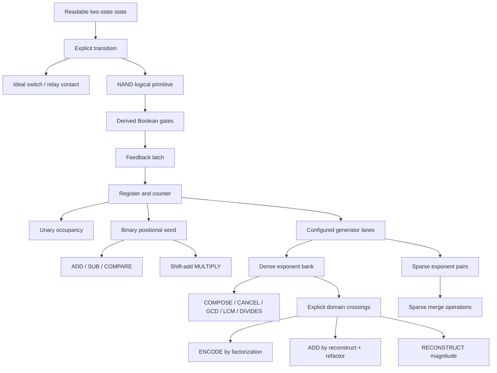
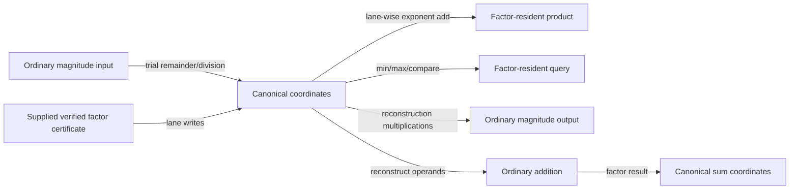
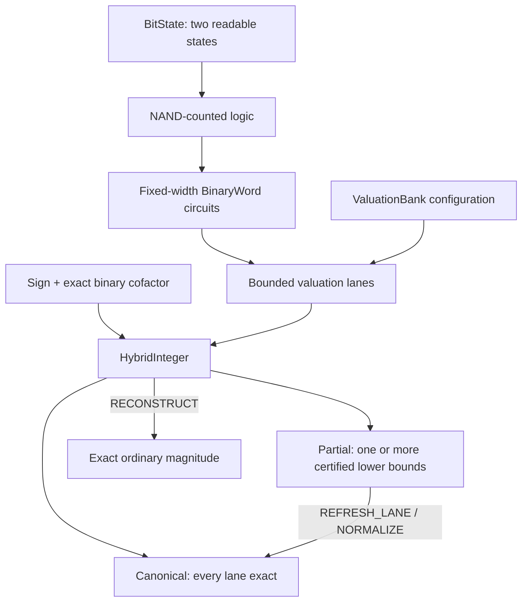

# Build 000 architecture

## Earned fork



The fork is at representation, not at the physical or logical state floor. Both numeric paths use ordinary binary cells; the coordinate path also uses binary arithmetic inside exponent lanes.

## Cost flow



The shortest arrow in source code is not assumed to be the cheapest. Receipts retain gate work, trial operations, reconstruction multiplications, and lane traffic separately.

## Type boundary

```text
PrimeBasis
  - finite ordered ordinary-prime labels
  - configured/certified outside the datapath

PrimeCoordinates
  - positive values only
  - one fixed-width binary exponent per basis lane
  - 1 = all-zero exponents
  - basis escape and exponent overflow are explicit failures

TaggedPrimeValue
  - zero tag OR sign + positive PrimeCoordinates

SparsePrimeCoordinates
  - sorted unique nonzero (lane index, exponent) pairs
  - abstract merge and payload accounting
```

## VM boundary

The VM is a probe, not a proposed general CPU.

| Local instruction | Boundary instruction |
|---|---|
| `LOAD_CERTIFIED` | `LOAD_MAGNITUDE` |
| `COMPOSE` | `RECONSTRUCT` |
| `CANCEL` | `ADD_REFACTOR` |
| `MEET` / `JOIN` |  |
| `PROJECT` |  |

A generic `DECOMPOSE` instruction is intentionally absent because it would disguise factorization as a primitive.

## Model exclusions

No conclusion about physical area, energy, clock frequency, wire delay, fan-out, thermal behavior, relay bounce, analog metastability, or fabrication follows from this architecture. HDL synthesis is a Build 001 candidate.

<!-- BEGIN BUILD 001 ARCHITECTURE -->

# Build 001 architecture

This section describes the implemented Build 001 hybrid experiment. It extends, but does not revise, the Build 000 architecture above.

## Earned hybrid layer



The physical/logical floor remains binary. `BitState` supplies the abstract distinction, `GateNetwork.Nand` remains the primitive combinational gate, and bounded exponent operations reuse NAND-counted `BinaryWord` circuits. Build 001 forks above that shared floor by pairing a finite valuation bank with an exact ordinary-binary cofactor.

The bank is an immutable, ordered configuration of distinct ordinary primes. It may contain at most 4,096 lanes; an empty bank is retained as a no-bank control. Exponent words have one declared width, bounded to 1 through 4,096 bits. Bank construction checks primality, ordering, uniqueness, and size before a value can use the configuration.

## Numeric contract

A nonzero `HybridInteger` denotes

```text
sign * cofactor * product(bank[i] ^ exponent[i])
```

with these implemented invariants:

- `sign` is `-1` or `+1`, and `cofactor` is a positive exact `BigInteger`.
- Every bank lane contains one nonnegative fixed-width binary exponent.
- A `KnownExact` lane certifies that the cofactor is not divisible by that lane's prime.
- A `CertifiedLowerBound` lane certifies the stored exponent but permits further copies of that prime to remain in the exact cofactor.
- Zero has one form: sign zero, zero cofactor, zero exponents, and exact lane knowledge.
- The multiplicative identity is sign `+1`, cofactor one, and all-zero exponents.
- Overflow, bank mismatch, width mismatch, invalid lane, malformed ingress, and invalid serialization are explicit failures rather than alternate numeric encodings.

`HybridValidity.Canonical` means every valuation lane is exact. `HybridValidity.Partial` means at least one lane is a certified lower bound. Partial does not mean that the number itself is approximate: the cofactor remains exact, so reconstruction remains an exact signed integer. It means only that the cached valuation decomposition is not fully normalized.

The implementation therefore has canonical and deferred paths inside one immutable numeric type rather than separate authoritative and unchecked types. Structured ingress validates its components. Claimed-magnitude ingress additionally reconstructs and compares the components with the supplied magnitude. Deterministic, versioned JSON serialization omits provenance from numeric identity and validates decoded fields before constructing a value.

## Operation domains and crossings

| Domain | Implemented behavior |
|---|---|
| Bank-local | Lane valuation reads, exact/lower-bound metadata, bounded lane add/subtract/compare, and zero/sign cases |
| Cofactor arithmetic | Exact `BigInteger` addition, multiplication, division, remainder, GCD, and exponentiation |
| Mixed | Composition, addition, exact division, powers, GCD/LCM, divisibility, and rational cancellation when both lane and cofactor work are required |
| Maintenance | Selected-lane refresh, full normalization, and explicit bank migration |
| Boundary | Binary/component ingress, claimed-magnitude verification, reconstruction, numeric crossing, serialization, and deserialization |

Receipts classify an operation as `BankNative`, `CofactorArithmetic`, `Mixed`, `Maintenance`, `Boundary`, or `None`. Their cost ledger keeps `Ingress`, `Native`, `Maintenance`, and `Egress` phases separate. NAND work, trial remainders and divisions, cofactor arithmetic, reconstruction work, operand bits, lane traffic, knowledge transitions, metadata traffic, serialization bytes, and migrations remain named counters rather than a combined score.

Multiplication adds each pair of bounded exponents and multiplies the exact cofactors. A result lane is exact only when both source lanes were exact. The general exact-division, divisibility, GCD, and LCM paths require canonical operands, apart from determinate zero cases; they do not treat a lower bound as an exact valuation. `RECONSTRUCT` is an explicit magnitude crossing and charges the prime-power and cofactor multiplications used to produce the ordinary signed integer.

## Addition and deferred valuation knowledge

`ADD_PRESERVE` does not assume that addition is bank-local. For each lane it retains the minimum stored exponent, folds each operand's exponent difference into that operand's exact residual, and performs an ordinary signed cofactor addition. Exact cancellation produces canonical zero.

For a nonzero sum, a lane is marked exact only when both input lanes were exact and their exponents differed. In that case the unequal-valuation rule proves that the minimum is the exact output valuation. Every other lane is marked `CertifiedLowerBound`; zero is never substituted for unknown valuation structure.

`REFRESH_LANE` trial-divides the exact cofactor by one selected prime, adds the extracted count to that bounded exponent, and marks the lane exact. `NORMALIZE` applies that operation to every lower-bound lane. Both operations are transactional: overflow returns a failure without committing a truncated value.

## Explicit bank migration

`MIGRATE_BANK` creates a value under a separately validated target bank; it never reinterprets lanes in place.

- Retained primes copy their exponent and knowledge state.
- Removed prime powers are multiplied back into the exact cofactor.
- Newly admitted primes are extracted from that cofactor and enter as exact lanes.
- A requested target exponent width is checked before migration.
- Overflow fails transactionally, leaving the source value and its bank unchanged.

The mechanism exposes migration work and supports fixed, workload-selected, or experimentally changed configurations. It does not implement an automatic adaptive-bank policy.

## Hybrid VM boundary

The Build 001 `HybridMachine` is a traceable experiment over immutable value registers. Its implemented instruction families are:

| Family | Instructions |
|---|---|
| Ingress | `LOAD_BINARY`, `LOAD_COMPONENTS`, `LOAD_CLAIMED_MAGNITUDE` |
| Arithmetic | `COMPOSE`, `ADD_PRESERVE`, `EXACT_DIVIDE`, `POWER` |
| Maintenance | `REFRESH_LANE`, `NORMALIZE`, `MIGRATE_BANK` |
| Queries/crossings | `VALUATION`, `RECONSTRUCT` |

Execution halts on the first failed instruction. Sources are read before a destination is committed, so destination/source aliasing does not erase an operand. A successful producer atomically installs its result. A failed producer removes and invalidates its destination; later reads return `InvalidRegister` instead of observing an older value. Scalar valuation or reconstruction outputs are cleared before their producing instruction, preventing a failed query from exposing an earlier successful scalar. Malformed instructions are converted to `InvalidInstruction` receipts, and the trace retains the per-step receipt plus the accumulated phase ledger.

## Build 001 model exclusions

- The cofactor is an exact ordinary integer, not a prime atom, generator label, or promise of complete factorization.
- A certified lower bound is not an unchecked or stale value. Operations that require exact valuations must normalize or fail explicitly.
- Build 001 does not expose generic `DECOMPOSE` or universal factorization as a primitive.
- Migration is explicit maintenance, not a free relabeling or an implemented autonomous cache policy.
- NAND counts cover the logical lane circuits that are actually modeled. Host `BigInteger` arithmetic, prime validation, allocation, serialization, VM dictionaries, wiring, fan-out, and control hardware are not thereby gate-level implementations.
- The heterogeneous receipt counters are not interchangeable physical units and do not establish latency, energy, area, throughput, or asymptotic superiority.
- Contract-valid values are not resource-hardened. Reconstruction, addition residual powers, bank eviction, cofactor power, repeated refresh, and serialization can exceed practical work or allocation before a typed receipt; callers need external budgets.
- The VM is a bounded research probe, not a proposed general CPU, production serialization protocol, cryptographic representation, or hardware specification.

<!-- END BUILD 001 ARCHITECTURE -->
